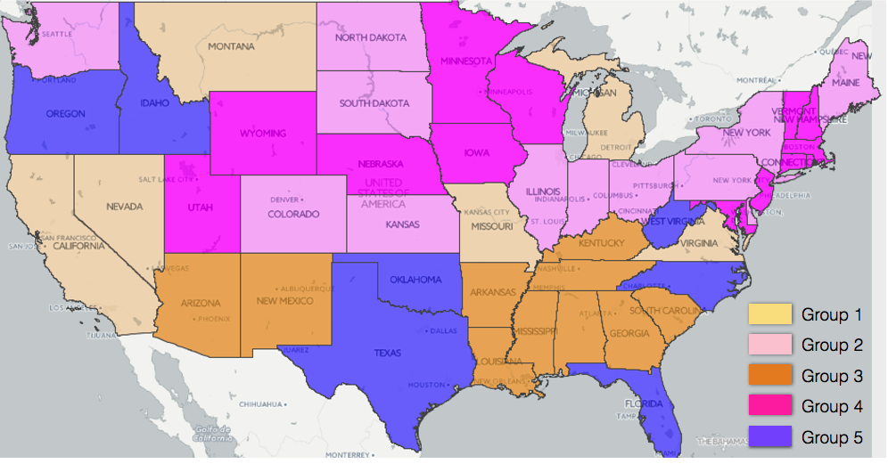
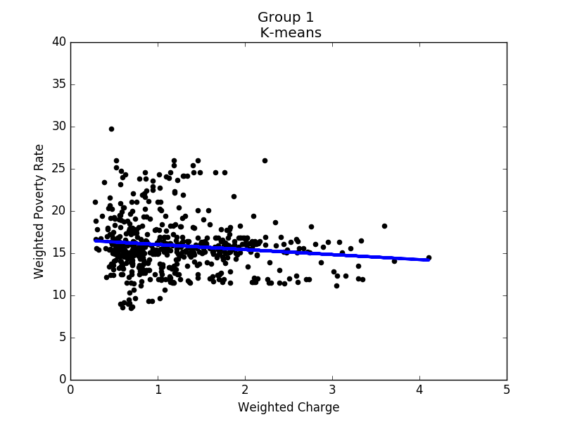
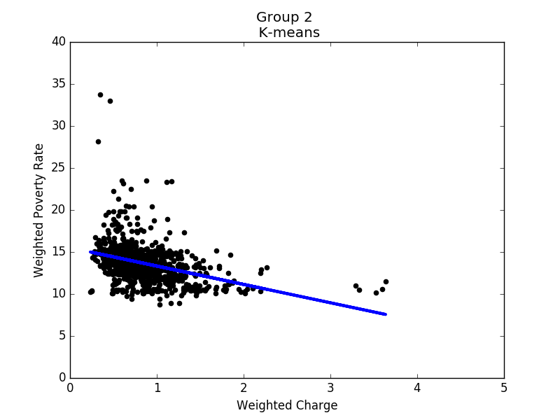
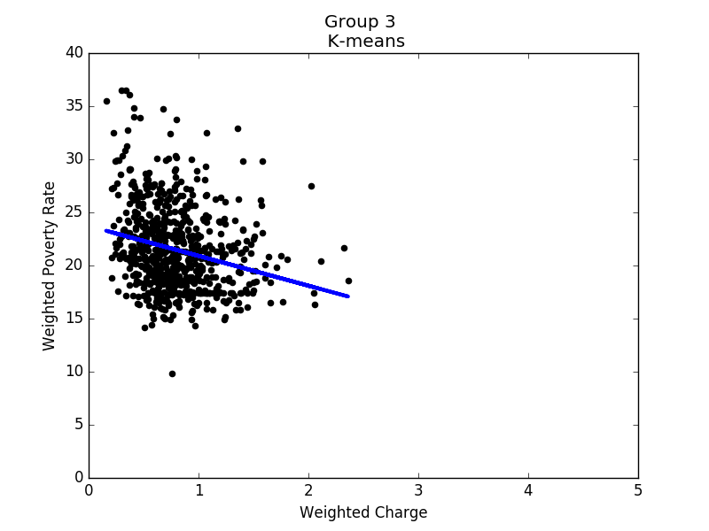
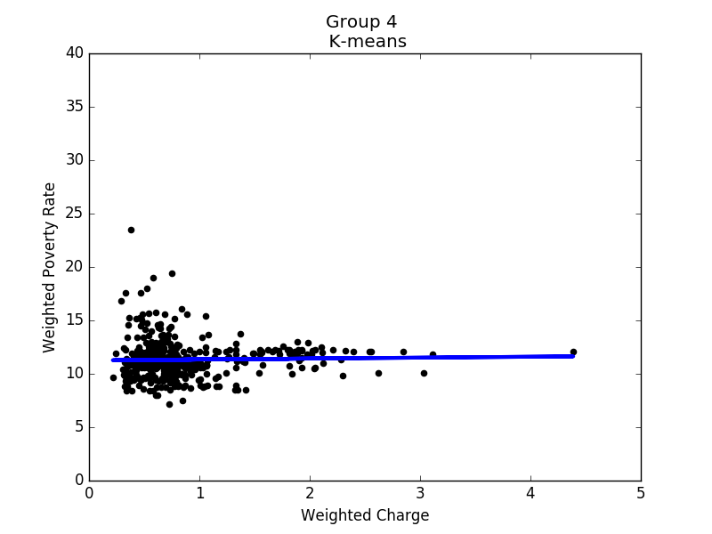
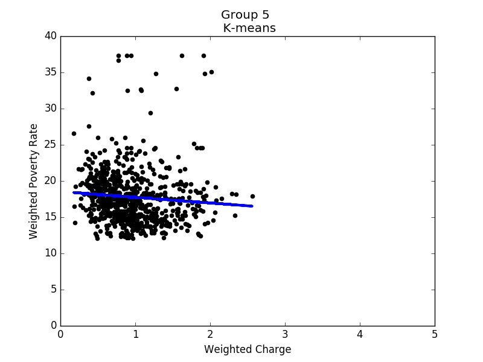

# Data Mining Project
## Topic : Correlation between hospital charges and local poverty rates

### Data resource

*[Inpatient Prospective Payment System](https://data.cms.gov/Medicare/Inpatient-Prospective-Payment-System-IPPS-Provider/ 97k6-zzx3)

*[Poverty levels](http://www.census.gov/did/www/saipe/data/model/tables.html)

### 
### Result

### Conclution

There is negative correlation between hospital charges and local poverty rates, which makes hospital costs in poor areas lower than in rich areas. The weighted poverty rate increases the correlation. However, the data is more spread out than we thought, and the correlation is not as strong as we expected. It is possible that there are other important factors affecting hospital charges that are not considered in our study. It could be a policy issue.

Actually, in the beginning, our goal was to find whether there was a correlation between average family income and hospital charges. However, we could not find data on average household income in each county. We guess it is harmful to make these data public since it may cause discrimination and is possible to affect the safety of prosperous areas. The previous class about ethics also made us reconsider how to present our results. We had planned to point out hospitals near areas with high poverty rates whose charges are high. However, after that class, we decided not to do this.

Besides, we learned that it is not easy to define whether one data point is noise or not. Originally, we had planned to remove outliers after linear regression. However, the advice we got was that we should not remove any data point even though it is far away from the model unless we have strong reasons to do so. This is confusing at first but in the end we understand the importance of every data point. That is to say, if data points are far away from the model, we can not simply say that they are noise or remove them. What we have to do is to analyze whether it indicates other characteristics.

We also find a paper, Inpatient Hospital Charge Variability of U.S. Hospitals, whose conclusion is similiar to us. In this paper, it presents that hospitals price- setting strategies associate with uninsured status, which has positive correlation to poverty rate.

